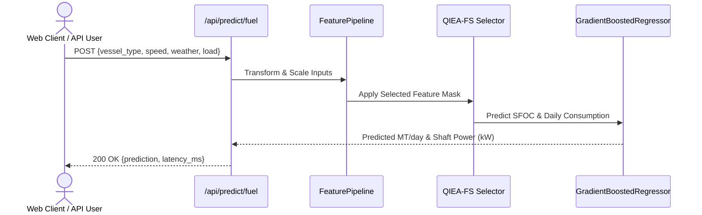
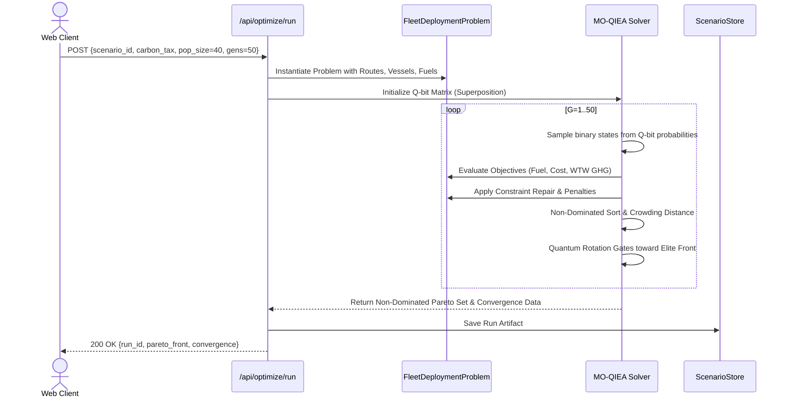

# Sequence Diagrams
## Workflow Sequences for Prediction, Scenario Optimization, and Report Export

### 1. Fuel Prediction Sequence

```mermaid
sequenceDiagram
    actor Client as Web Client / API User
    participant Router as /api/predict/fuel
    participant Pipeline as FeaturePipeline
    participant QSelector as QIEA-FS Selector
    participant Model as GradientBoostedRegressor

    Client->>Router: POST {vessel_type, speed, weather, load}
    Router->>Pipeline: Transform & Scale Inputs
    Pipeline->>QSelector: Apply Selected Feature Mask
    QSelector->>Model: Predict SFOC & Daily Consumption
    Model-->>Router: Predicted MT/day & Shaft Power (kW)
    Router-->>Client: 200 OK {prediction, latency_ms}
```

---

### 2. Multi-Objective Fleet Optimization Sequence

```mermaid
sequenceDiagram
    actor Client as Web Client
    participant Router as /api/optimize/run
    participant Prob as FleetDeploymentProblem
    participant Engine as MO-QIEA Solver
    participant DB as ScenarioStore

    Client->>Router: POST {scenario_id, carbon_tax, pop_size=40, gens=50}
    Router->>Prob: Instantiate Problem with Routes, Vessels, Fuels
    Router->>Engine: Initialize Q-bit Matrix (Superposition)
    loop G=1..50
        Engine->>Engine: Sample binary states from Q-bit probabilities
        Engine->>Prob: Evaluate Objectives (Fuel, Cost, WTW GHG)
        Engine->>Prob: Apply Constraint Repair & Penalties
        Engine->>Engine: Non-Dominated Sort & Crowding Distance
        Engine->>Engine: Quantum Rotation Gates toward Elite Front
    end
    Engine-->>Router: Return Non-Dominated Pareto Set & Convergence Data
    Router->>DB: Save Run Artifact
    Router-->>Client: 200 OK {run_id, pareto_front, convergence}
```
